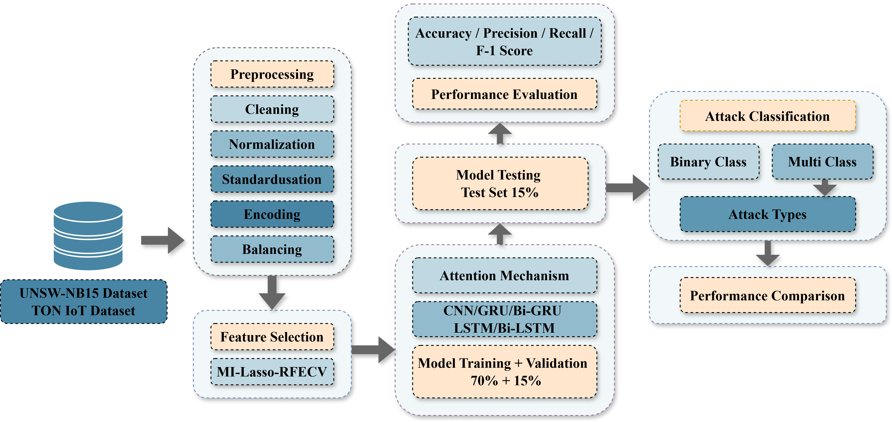
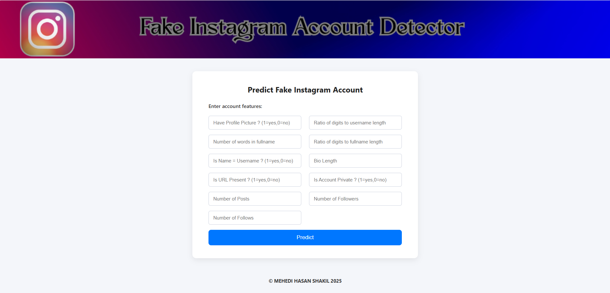
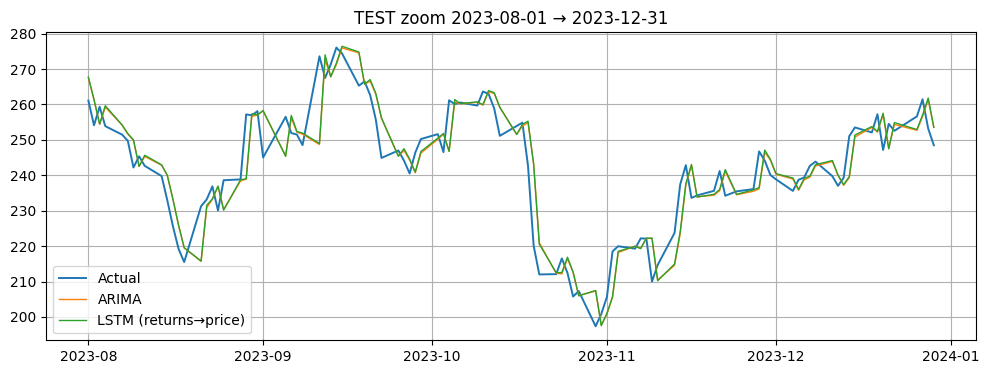

  

<h1 align="center">Mehedi Hasan Shakil</h1>

  Machine Learning Engineer · Deep Learning · NLP · Security

I work on applied machine learning problems with a focus on security, natural language processing, and real-world deployment. My experience includes deep learning–based malware detection, intrusion detection systems, NLP models using transformers, and end-to-end ML pipelines from data preprocessing to API deployment. I have published peer-reviewed research at IEEE conferences and enjoy building systems that balance research rigor with practical usability.

  <a href="mailto:shakilcuetcse@gmail.com">Email</a> ·
  <a href="https://github.com/mehedi-shakil">GitHub</a> ·
  <a href="https://www.linkedin.com/in/mehedi-hasan-shakil-075608232/">LinkedIn</a> ·
  <a href="https://scholar.google.com/citations?user=V7QkzPEAAAAJ&hl=en">Google Scholar</a> ·
  <a href="CV.pdf">CV</a>

---

# Projects

  

    
    

      
Android Malware Detection

      

        Static Android malware detection using optimized feature selection and a weighted CNN/Bi-LSTM ensemble.
      

      

        <a href="https://github.com/mehedi-shakil/Android-Malware-Detection" target="_blank" rel="noopener">GitHub ↗</a>
      

    

  

  

    
    

      
Optimized-IoT-Intrusion-Detection-by-Feature-Optimization 

      

      IoT IDS with attention modeling plus a novel hybrid feature-selection pipeline (filter + wrapper + embedded) for stable multi-class detection.
      

      

        <a href="https://github.com/mehedi-shakil/Optimized-IoT-Intrusion-Detection-by-Feature-Optimization" target="_blank" rel="noopener">GitHub ↗</a>
      

    

  

  

    
    

      
Hate Speech Detection API

      

        Fine-tuned BERT for 31k+ tweet hate-speech classification and deployed via Flask API for real-time inference.
      

      

        <a href="https://github.com/mehedi-shakil/hate-speech-api" target="_blank" rel="noopener">GitHub ↗</a>
      

    

  

  

    
    

      
Fake Instagram Account Detection

      

      Fake-account detection using profile/behavior features with supervised ML and robust feature engineering for noisy social data.
      

      

        <a href="https://github.com/mehedi-shakil/fake-insta-flask" target="_blank" rel="noopener">GitHub ↗</a>
      

    

  

  

    
    

      
Time Series Forecasting (TSLA)

      

       TSLA close-price forecasting comparing ARIMA vs LSTM with structured evaluation and error analysis under volatility.
      

      

        <a href="https://github.com/mehedi-shakil/Time_Series_Forecasting___TSLA_Close" target="_blank" rel="noopener">GitHub ↗</a>
      

    

  

---

# Publications

## Empowering Android Malware Detection: A Deep Learning Ensemble with Optimal Features  
**Conference:**  2023 26th International Conference on Computer and Information Technology (ICCIT) 

This paper presents an Android malware detection framework based on static feature analysis, RFECV-based feature optimization, and a weighted ensemble of Bi-LSTM, Bi-GRU, and 1D CNN models. The best-performing Bi-LSTM + CNN ensemble achieved **98.99% accuracy** on the Drebin dataset.  
🔗 [Paper Link](https://ieeexplore.ieee.org/document/10441465)

  
Abstract

  

    Because of the rapid expansion of mobile devices and the growing reliance on mobile applications, there has been an increase in Android malware threats, necessitating the development of sophisticated detection systems. This research proposes a technique for detecting Android malware that makes use of several deep learning models. The goal is to provide an accurate and dependable method for classifying mobile applications as malicious or benign. To assure data integrity, the Drebin dataset is preprocessed. RFECV was employed to obtain the optimal features for deep learning algorithms such as Bi-LSTM, Bi-GRU, and 1D CNN. The dataset was trained using the selected features for each deep learning algorithm based on the feature selection method. The ensemble technique, employing a weighted average method, was utilised to combine the predictions of the individual models. Extensive testing revealed that combining Bi-LSTM and CNN in the ensemble technique achieves the greatest accuracy of 98.99%. This combination highlights the efficiency of combining various models strengths for Android malware detection.
  

---

## Optimized IoT Security with Attention-Based Hybrid Deep Learning Approach  
**Conference:** 2024 27th International Conference on Computer and Information Technology (ICCIT)

This work proposes an IoT intrusion detection framework that combines CNN for feature extraction, Bi-GRU for temporal modeling, Multi-Head Attention for focusing on critical traffic patterns, and a hybrid feature-selection pipeline using MI, Lasso, and RFECV. The proposed method achieved **99.73% binary accuracy** and **99.68% multi-class accuracy** on the TON-IoT dataset.  
🔗 [Paper Link](https://ieeexplore.ieee.org/document/11022121)

  
Abstract

  

    Maintaining strong network security in the quickly developing Internet of Things (IoT) space is crucial because IoT traffic is so varied and complicated. By focusing on the TON IoT dataset, this study introduces a novel method for intrusion detection in IoT networks. Bidirectional Gated Recurrent Units (Bi-GRU) were utilized in a deep learning architecture to capture temporal dependencies in the data, while Convolutional Neural Networks (CNN) were utilized for effective feature extraction. By including a Multi-Head Attention layer, the model was able to select and pay attention to important characteristics, which enhanced its ability to focus on important patterns. A hybrid feature selection approach incorporating MI, Lasso, and RFECV was employed to generate a refined feature set, maintaining critical information for improved model performance. With a 99.73% binary classification accuracy and a 99.68% multi-class classification accuracy, our work outperformed the state-of-the-art techniques. These findings highlight how well CNN, Bi-GRU, and Attention mechanisms work together to detect intricate intrusion patterns in IoT environments, which advances the security measures required to shield IoT networks from dynamic cyber attacks.
  

