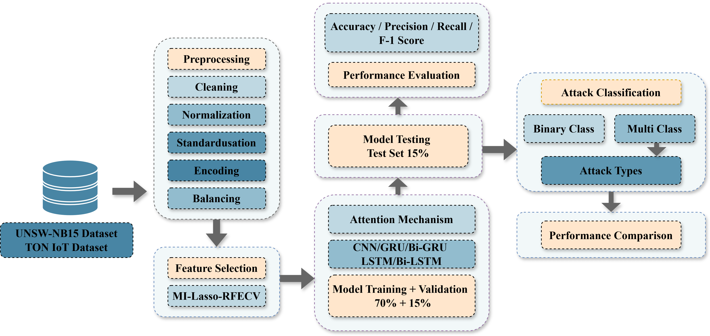
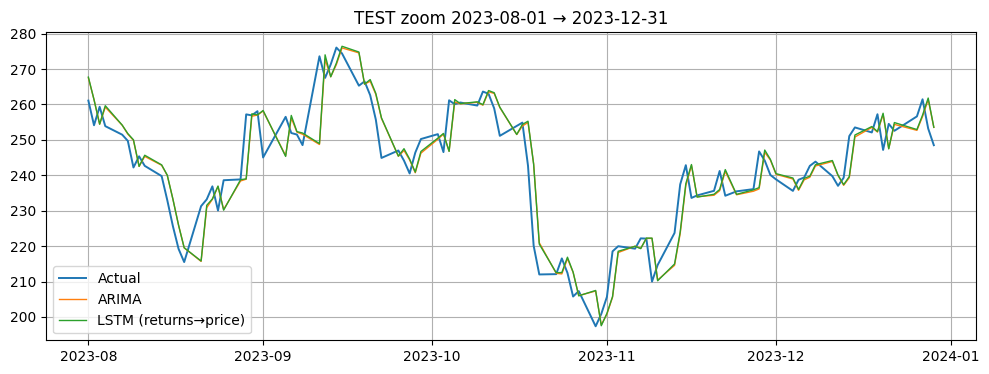

# Projects

  

    
    

      
Android Malware Detection

      

        Drebin malware classification with RFECV-selected static features + Bi-LSTM/CNN weighted ensemble; feature selection and ensembling did more than scaling model size.
      

      

        <a href="https://github.com/mehedi-shakil/Android-Malware-Detection" target="_blank" rel="noopener">GitHub ↗</a>
      

    

  

  

    
    

      
Optimized IoT Security (Hybrid Attention IDS)

      

        Multi-class IoT intrusion detection with hybrid attention sequence modeling; performance depends heavily on clean splits and imbalance handling.
      

      

        <a href="https://github.com/mehedi-shakil" target="_blank" rel="noopener">GitHub ↗</a>
      

    

  

  

    
    

      
Hate Speech Detection API

      

        Fine-tuned BERT for hate speech classification and deployed a Flask REST API; reliable inference packaging matters as much as accuracy.
      

      

        <a href="https://github.com/mehedi-shakil/hate-speech-api" target="_blank" rel="noopener">GitHub ↗</a>
      

    

  

  

    
    

      
Fake Instagram Account Detection

      

        Supervised fake-account detection using profile/behavior features; strong feature signals beat complex models on noisy social data.
      

      

        <a href="https://github.com/mehedi-shakil" target="_blank" rel="noopener">GitHub ↗</a>
      

    

  

  

    
    

      
Time Series Forecasting (TSLA)

      

        ARIMA vs LSTM forecasting on TSLA close prices; stability and error analysis matter more than tiny accuracy gains in volatility.
      

      

        <a href="https://github.com/mehedi-shakil/Time_Series_Forecasting___TSLA_Close" target="_blank" rel="noopener">GitHub ↗</a>
      

    

  

